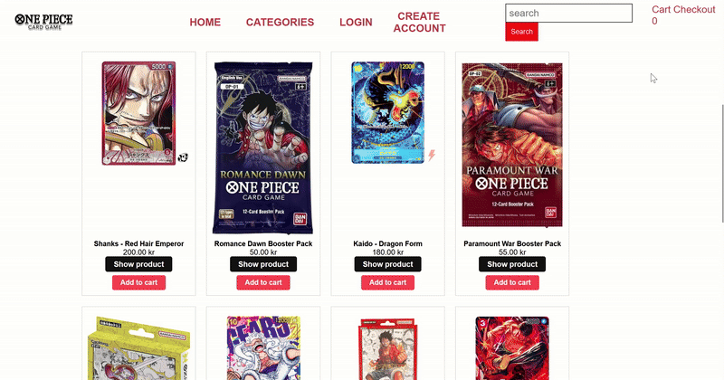

# OnePiece Cardshop – PHP Backend-projekt

## Översikt
OnePiece Cardshop är en webbapplikation byggd med PHP och MySQL som fungerar som en onlinebutik för samlarkort. Projektet visar hur man bygger en modern backend med fokus på säkerhet, struktur och e-handelsfunktioner.

## Teknisk stack
- PHP (med Composer)
- MySQL
- Stripe API
- HTML/CSS/JS (frontend)

## Funktioner
- Användarregistrering och inloggning
- Produktvisning och sökning
- Varukorg och checkout med Stripe
- Adminpanel för produkthantering

## Installation
1. Klona projektet
2. Installera beroenden med Composer
3. Skapa databas i MySQL
4. Konfigurera `.env`-fil med databas- och Stripe-nycklar
5. Kör projektet lokalt via PHP-server

## Projektstruktur
- `/pages` – Sidor (index, produkter, checkout)
- `/models` – Databasmodeller
- `/components` – UI-komponenter
- `/public` – Statiska filer
- `.env` – Miljövariabler

## Skärmdumpar

