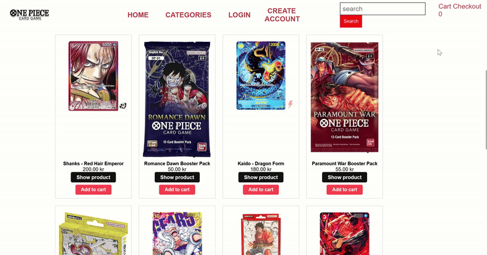

# OnePiece Cardshop

A PHP-based online shop for One Piece trading cards.

## Tech stack
- PHP + Composer
- MySQL
- Stripe API
- Plain HTML / CSS / JS frontend

## Features
- User registration and login
- Product browsing by category
- Product search
- Cart and Stripe checkout
- Sticky navbar with live cart count

## Project structure
```
/pages        – Page templates (index, products, info, checkout, login, register)
/components   – Reusable PHP components (navbar, footer, ticker)
/models       – Database models (Product, Cart, UserDatabase)
/styles       – CSS (reset, variables, global, per-page)
/public       – Static assets (images)
/utils        – Validator and router
```

## CSS architecture
Styles follow a layered approach:
- `reset.css` – box-sizing and baseline resets
- `variables.css` – CSS custom properties (colors, spacing, font)
- `global.css` – shared layout, product grid/card, buttons
- Page-specific files for overrides and unique styles

## Installation
1. Clone the repo
2. Run `composer install`
3. Create a MySQL database and import the schema
4. Copy `.env.example` to `.env` and fill in your DB and Stripe credentials
5. Serve locally with the PHP built-in server or a local stack (XAMPP, Laragon, etc.)

## Screenshots


